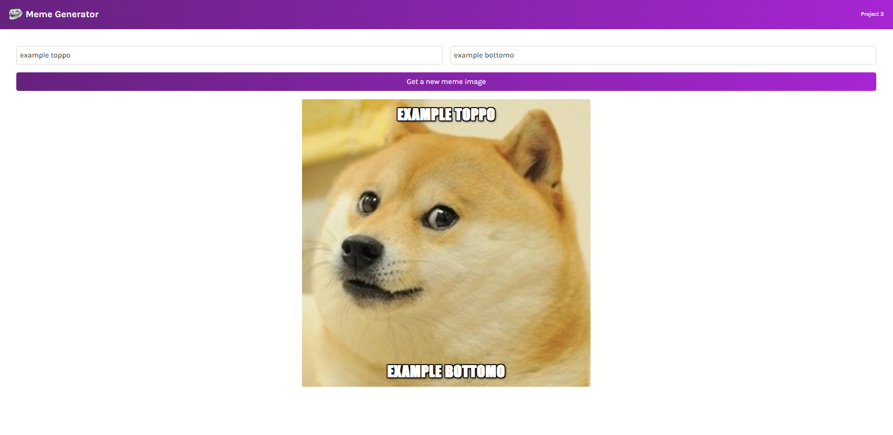

#  ReactDemo3-MemeGenerator

 

 

This repo contains a simple meme generator react project; it takes the top 100 most popular memes via api call, and allows text to be placed over the image. 
It is made as part of the following course:

[FreeCodeCamp's React Course 2022](https://www.youtube.com/watch?v=bMknfKXIFA8&list=WL&index=1)
